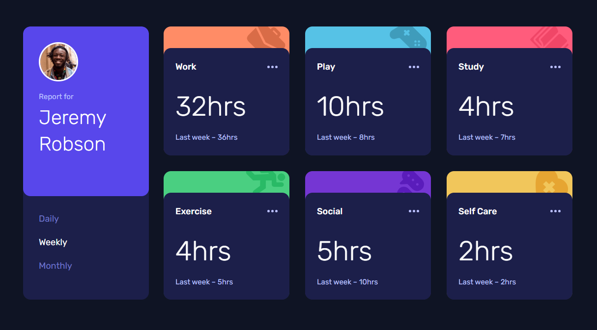

# Frontend Mentor - Time tracking dashboard solution

This is a solution to the [Time tracking dashboard challenge on Frontend Mentor](https://www.frontendmentor.io/challenges/time-tracking-dashboard-UIQ7167Jw). Frontend Mentor challenges help you improve your coding skills by building realistic projects.

## Table of contents

- [Overview](#overview)
  - [The challenge](#the-challenge)
  - [Expected Behavior](#expected-behavior)
  - [Screenshot](#screenshot)
  - [Links](#links)
- [My process](#my-process)
  - [Built with](#built-with)
  - [What I learned](#what-i-learned)
  - [Continued development](#continued-development)
  - [Useful resources](#useful-resources)
- [Author](#author)

## Overview

### The challenge

Users should be able to:

- View the optimal layout for the site depending on their device's screen size
- See hover states for all interactive elements on the page
- Switch between viewing Daily, Weekly, and Monthly stats

### Expected Behavior

- The text for the previous period's time should change based on the active timeframe. For Daily, it should read "Yesterday" e.g "Yesterday - 2hrs". For Weekly, it should read "Last Week" e.g. "Last Week - 32hrs". For monthly, it should read "Last Month" e.g. "Last Month - 19hrs".

### Screenshot

### Links

- Solution URL: [GitHub Repo](https://github.com/morauszkia/fm-time-tracking-dashboard/)
- Live Site URL: [GitHub Pages](https://morauszkia.github.io/fm-time-tracking-dashboard/)

## My process

### Built with

- Semantic HTML5 markup
- CSS custom properties
- Flexbox
- CSS Grid
- Mobile-first workflow
- [React](https://reactjs.org/) - JS library
- [Vite](https://vite.dev) - Build tool
- [Tailwind.css](https://tailwindcss.com/) - For styles

### What I learned

This was the first time I used Tailwind.css to style the components. The docs and the Tailwind CSS IntelliSense extension for VS Code were both a ton of help.

### Continued development

Sometime in the future it would be great to add a light/dark theme switcher to the project, and maybe also add the functionality to choose between users.

### Useful resources

- [Tailwind.css Docs](https://tailwindcss.com/docs/) - This helped me a lot with the styling as I was new to Tailwind.
- [Tailwind CSS IntelliSense Extension for VS Code](https://marketplace.visualstudio.com/items?itemName=bradlc.vscode-tailwindcss) - I wouldn't even try to use Tailwind without this extension, which made my life so much easier.
- [Static Site Deployment in Vite Docs](https://vite.dev/guide/static-deploy.html#deploying-a-static-site) - I use the approach outlined here to publish the page to GitHub Pages, but it has manual for GitLab, Netlify, Vercel, Cloudflare Pages, and other deployments, too.

## Author

- Frontend Mentor - [@mantis](https://www.frontendmentor.io/profile/morauszkia)
- X - [@mantis_hu86](https://x.com/mantis_hu86)
- Github - [@mantis](https://github.com/morauszkia)
- LinkedIn - [András Morauszki](https://www.linkedin.com/in/andras-morauszki/)
